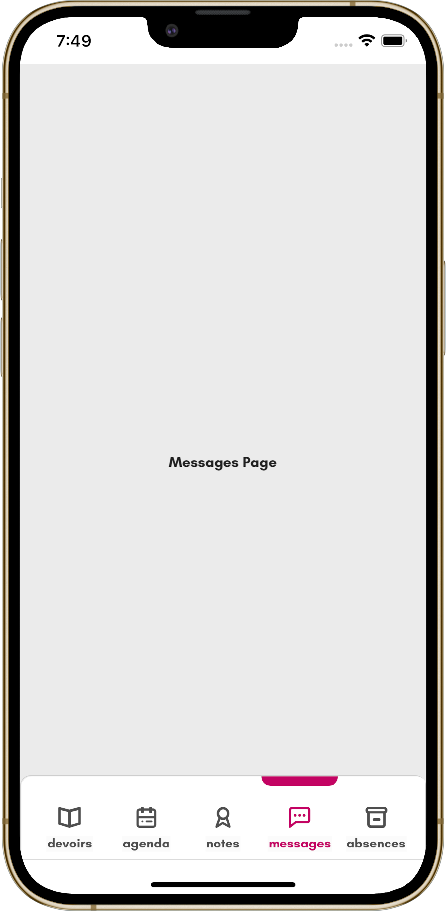

# Navbar Animation #2

**.NET MAUI** implementation of [Navbar Animation #2](https://dribbble.com/shots/14122275-Navbar-Animation-2) design by [Marie Bernard](https://dribbble.com/marie_brn).

## Original design

## My .NET MAUI implementation

The application was built using .NET MAUI APIs and my library [SimpleToolkit](https://github.com/RadekVyM/SimpleToolkit).

    
    &nbsp;&nbsp;&nbsp;&nbsp;&nbsp;&nbsp;&nbsp;
    

    

### Supported platforms

These are all the platforms I have tested the app on:

- Android
- iOS (macOS)
- Windows

### Features

- Use of [SimpleToolkit](https://github.com/RadekVyM/SimpleToolkit) library
    - `SimpleShell`
- `GraphicsView`
- Animations