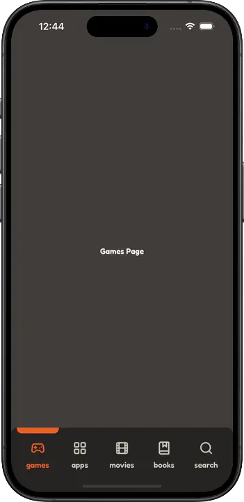

# Navbar Animation #2

**.NET MAUI** tab bar inspired by the [Navbar Animation #2](https://dribbble.com/shots/14122275-Navbar-Animation-2) design by [Marie Bernard](https://dribbble.com/marie_brn).

https://github.com/user-attachments/assets/0e52fe5a-61c1-4815-a311-1b8fec02d6e0

This project demonstrates how to create a **custom tab bar** and integrate it with the `SimpleShell` control from [SimpleToolkit](https://github.com/RadekVyM/SimpleToolkit).

## Original design

Many thanks to [Marie Bernard](https://dribbble.com/marie_brn) for their beautiful original work.

## Installation

First, make sure you have your Visual Studio and .NET 8 environment set up for .NET MAUI development. If not, follow the [setup instructions](https://learn.microsoft.com/dotnet/maui/get-started/installation). Then make sure you have your [Android](https://learn.microsoft.com/dotnet/maui/get-started/first-app?pivots=devices-android) or [iOS](https://learn.microsoft.com/dotnet/maui/get-started/first-app?pivots=devices-ios) platform set up for deployment of the application.

Once everything is set up, you can clone the repo and run the application via Visual Studio or Visual Studio Code.

Here are some resources to learn more about .NET MAUI:

- [Official website](https://dotnet.microsoft.com/apps/maui)
- [Microsoft Learn](https://learn.microsoft.com/dotnet/maui/what-is-maui)
- [.NET MAUI GitHub repository](https://github.com/dotnet/maui)

## Features

Only .NET MAUI APIs and my [SimpleToolkit](https://github.com/RadekVyM/SimpleToolkit) library were used to create this sample.

    
    &nbsp;&nbsp;
    

